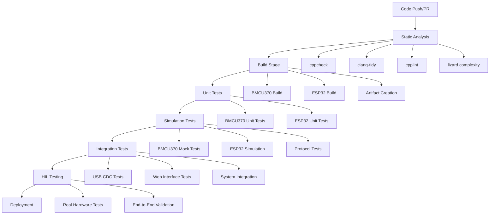

# Multi-Stage Automated CI Pipeline Design

## Overview

This document defines a comprehensive, multi-stage automated testing pipeline for the BMCU370t embedded firmware project, supporting both ESP32-S3 and CH32V203 platforms using GitHub Actions.

## Pipeline Architecture



## Stage Definitions

### Stage 1: Static Analysis (Code Quality)
**Trigger**: Every push and PR
**Runner**: ubuntu-latest
**Duration**: ~3-5 minutes

**Tools**:
- **cppcheck**: Static analysis for C/C++ bugs and undefined behavior
- **clang-tidy**: Static analysis and code modernization suggestions
- **cpplint**: Google's C++ style guide compliance checker
- **lizard**: Cyclomatic complexity analysis

**Scope**:
- All `.cpp` and `.h` files in `src/` (BMCU370)
- All source files in `esp32_firmware/src/` (ESP32)
- Configuration files and headers

**Quality Gates**:
- Zero critical cppcheck errors
- Complexity score < 15 (configurable)
- Style compliance warnings only

### Stage 2: Build Verification
**Trigger**: After static analysis passes
**Runner**: ubuntu-latest  
**Duration**: ~5-8 minutes

**Components**:
- **BMCU370 (CH32V203)**: PlatformIO build with size reporting
- **ESP32-S3**: PlatformIO build with filesystem generation
- **Artifact Creation**: Firmware binaries with metadata

**Quality Gates**:
- Both targets compile successfully
- Memory usage within acceptable limits (< 85% flash, < 80% RAM)
- All required artifacts generated

### Stage 3: Unit Testing
**Trigger**: After successful builds
**Runner**: ubuntu-latest
**Duration**: ~10-15 minutes

**BMCU370 Tests**:
- BambuBus protocol parsing
- USB CDC command handling
- ADC/sensor data processing
- Flash storage operations
- CRC validation functions

**ESP32 Tests**:
- HTTP request handling
- JSON API responses
- WiFi configuration logic
- USB host communication
- Data logging functions

**Framework**: PlatformIO Test Runner with Unity

### Stage 4: Simulation Testing
**Trigger**: After unit tests pass
**Runner**: ubuntu-latest
**Duration**: ~15-20 minutes

**Components**:
- **Mock BMCU370**: Python script simulating USB CDC responses
- **ESP32 Simulation**: Wokwi or PlatformIO native simulation
- **Protocol Validation**: End-to-end communication testing

**Test Scenarios**:
- Status request/response cycles
- Configuration parameter updates
- Error condition handling
- Timeout and reconnection logic

### Stage 5: Integration Testing
**Trigger**: After simulation tests pass
**Runner**: ubuntu-latest
**Duration**: ~10-15 minutes

**Scope**:
- Web interface functionality (pytest + Selenium)
- REST API endpoint validation
- JSON schema compliance
- Cross-platform communication protocols

**Tools**:
- **pytest**: Test framework
- **requests**: HTTP client testing
- **jsonschema**: API contract validation

### Stage 6: Hardware-in-the-Loop (HIL) Testing
**Trigger**: Manual or scheduled (for critical changes)
**Runner**: self-hosted with hardware
**Duration**: ~20-30 minutes

**Requirements**:
- Physical ESP32-S3 N4R2 board
- Physical CH32V203 board
- USB connections configured
- Automated flashing tools (esptool, dfu-util)

**Test Suite**:
- Live firmware flashing
- Real USB CDC communication
- Actual web interface testing
- Hardware control validation (LEDs, motors)
- System stress testing

## File Structure

```
.github/workflows/
├── build-and-quality.yml       # Stages 1-2 (current enhanced)
├── simulation-tests.yml        # Stage 4
├── integration-tests.yml       # Stage 5
└── hil-validation.yml          # Stage 6

tests/
├── unit/
│   ├── bmcu370/
│   │   ├── test_bambu_bus.cpp
│   │   ├── test_usb_protocol.cpp
│   │   └── test_adc_dma.cpp
│   └── esp32/
│       ├── test_web_server.cpp
│       ├── test_usb_host.cpp
│       └── test_data_logger.cpp
├── simulation/
│   ├── mock_bmcu370.py
│   ├── esp32_sim_tests.py
│   └── protocol_validation.py
├── integration/
│   ├── test_web_interface.py
│   ├── test_api_endpoints.py
│   └── conftest.py
├── hil/
│   ├── test_hardware_flash.py
│   ├── test_live_communication.py
│   └── test_system_validation.py
└── config/
    ├── cppcheck.cfg
    ├── clang-tidy.yaml
    └── pytest.ini
```

## Quality Gates and Metrics

### Build Quality
- **Zero build errors** for both platforms
- **Memory usage limits**:
  - BMCU370: < 85% flash (55KB), < 80% RAM (16KB)
  - ESP32: < 85% flash (1.3MB), < 50% RAM usage

### Code Quality
- **Static Analysis**: Zero critical issues
- **Complexity**: CCN < 15 per function
- **Test Coverage**: > 70% for critical modules
- **Code Style**: Consistent with project conventions

### Functional Quality
- **Unit Tests**: 100% pass rate
- **Simulation Tests**: Communication protocols validated
- **Integration Tests**: All API endpoints functional
- **HIL Tests**: Real hardware behavior verified

## Self-Hosted Runner Requirements

### Hardware Setup
- Linux machine (Ubuntu 20.04+)
- ESP32-S3 N4R2 development board
- CH32V203 development board  
- USB-to-serial adapters
- Power supplies and cables

### Software Dependencies
```bash
# Installation script for HIL runner
sudo apt-get update
sudo apt-get install -y python3 python3-pip
pip3 install platformio esptool dfu-util pytest requests

# Add user to dialout group for device access
sudo usermod -a -G dialout $USER
```

### Security Considerations
- Runner isolated network access
- Hardware reset capabilities
- Secure firmware storage
- Limited GitHub token permissions

## Monitoring and Reporting

### Success Metrics
- **Build Success Rate**: > 95%
- **Test Pass Rate**: > 98%
- **Pipeline Duration**: < 60 minutes total
- **HIL Success Rate**: > 90%

### Failure Handling
- Immediate notification on critical failures
- Automatic retry for intermittent issues
- Detailed logs and artifacts for debugging
- Rollback procedures for HIL testing

### Dashboard Integration
- GitHub Status Checks
- Build badges in README
- Historical trend analysis
- Performance regression detection

## Implementation Phases

### Phase 1: Foundation (Week 1)
- [x] Enhanced build and quality workflow
- [ ] Unit testing framework setup
- [ ] Basic static analysis integration

### Phase 2: Simulation (Week 2)
- [ ] Mock BMCU370 implementation
- [ ] ESP32 simulation environment
- [ ] Protocol testing suite

### Phase 3: Integration (Week 3)
- [ ] Web interface testing
- [ ] API validation suite
- [ ] Cross-platform communication tests

### Phase 4: HIL Setup (Week 4)
- [ ] Hardware runner configuration
- [ ] Live testing implementation
- [ ] Full end-to-end validation

## Configuration Management

### Environment Variables
```yaml
# Required GitHub Secrets
HIL_RUNNER_TOKEN: "GitHub token for self-hosted runner"
WOKWI_TOKEN: "Optional token for ESP32 simulation"

# Workflow Configuration
MAX_BUILD_TIME: "300" # seconds
ENABLE_HIL_TESTING: "false" # Manual override
COMPLEXITY_THRESHOLD: "15"
COVERAGE_THRESHOLD: "70"
```

### Customization Points
- Quality gate thresholds adjustable per project needs
- Test suite selection based on change scope
- HIL testing trigger conditions
- Notification and reporting preferences

This pipeline design ensures comprehensive automated validation while maintaining fast feedback cycles for developers and robust validation for production deployments.